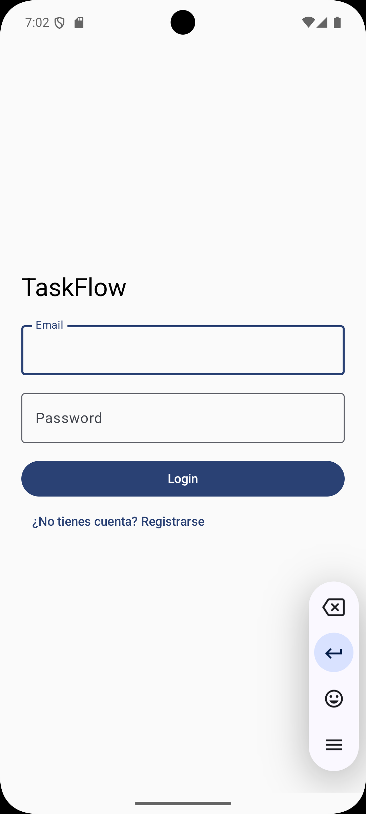
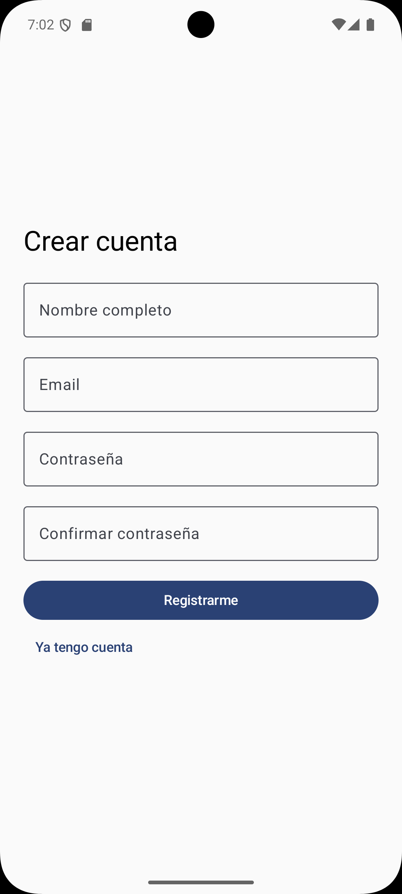
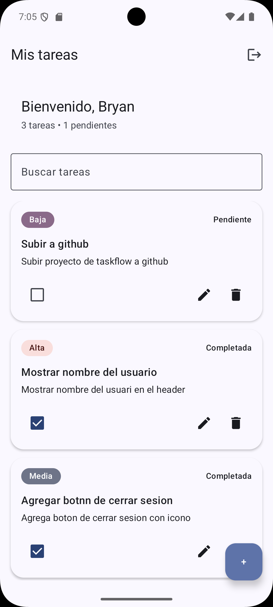
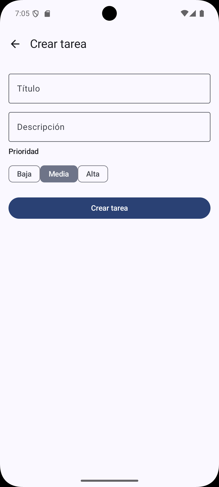
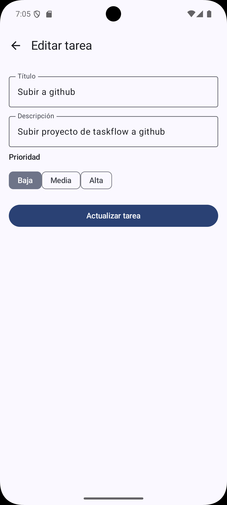

# TaskFlow

Aplicación Android para la gestión de tareas desarrollada con Jetpack Compose.

## Características

- Registro de usuarios
- Inicio y cierre de sesión
- Persistencia local con Room
- Gestión de sesiones con DataStore
- Creación de tareas
- Edición de tareas
- Eliminación de tareas
- Marcado de tareas completadas
- Búsqueda de tareas en tiempo real
- Prioridades (Alta, Media y Baja)

## Arquitectura

El proyecto sigue una arquitectura basada en MVVM y separación por capas:

```text
presentation/
domain/
data/
```

### Tecnologías utilizadas

- Kotlin
- Jetpack Compose
- Navigation Compose
- ViewModel
- StateFlow
- Room Database
- Hilt
- DataStore
- Coroutines

## Estructura del proyecto

```text
data/
├── local
├── repository
├── security
└── session

domain/
├── model
└── repository

presentation/
├── login
├── register
├── splash
└── task
```

## Capturas

### Inicio de sesión



### Registro de usuario


### Lista de tareas



### Crear tarea



### Editar tarea


## Objetivos del proyecto

Este proyecto fue desarrollado para practicar:

- Arquitectura MVVM
- Navegación entre pantallas con Compose
- Persistencia local con Room
- Inyección de dependencias con Hilt
- Manejo de estado con StateFlow
- Gestión de sesiones mediante DataStore

## Autor

Bryan Mancilla